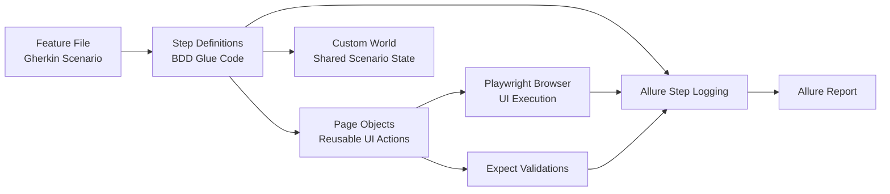
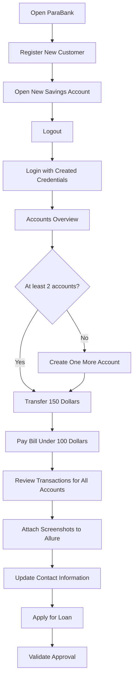
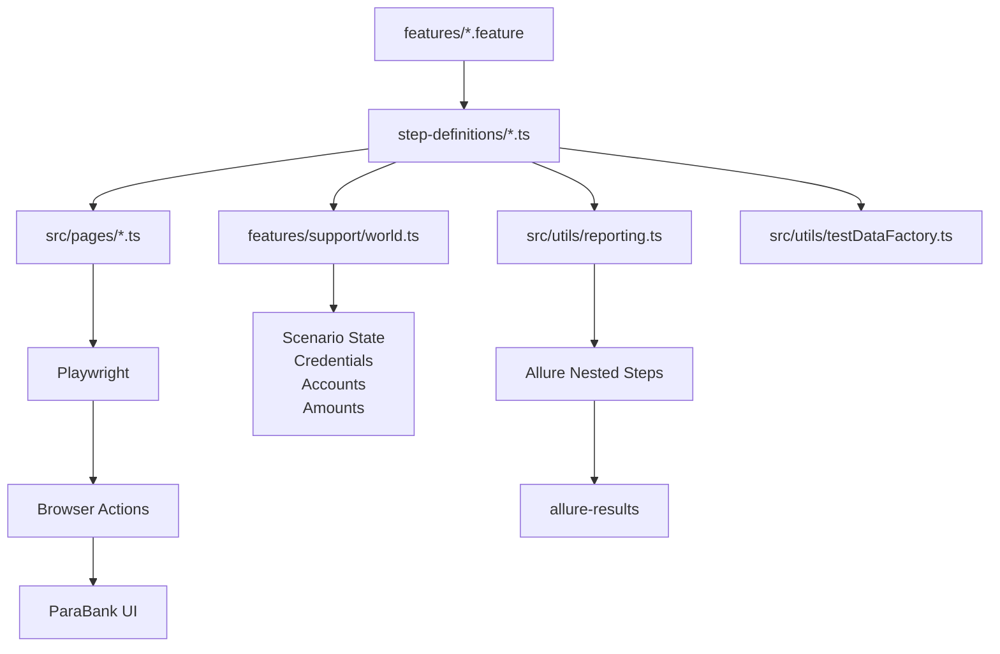
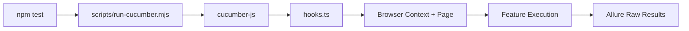
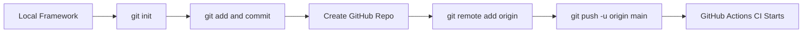
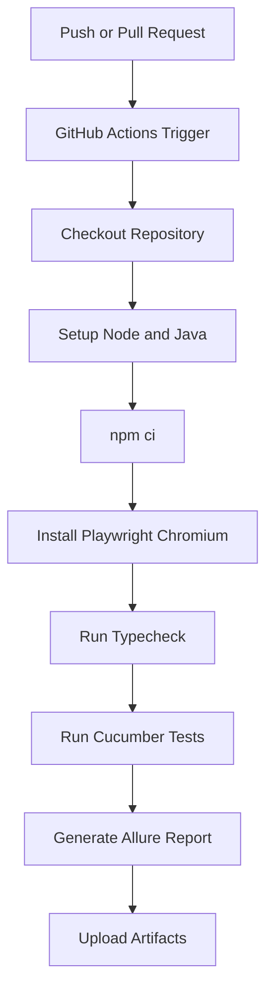
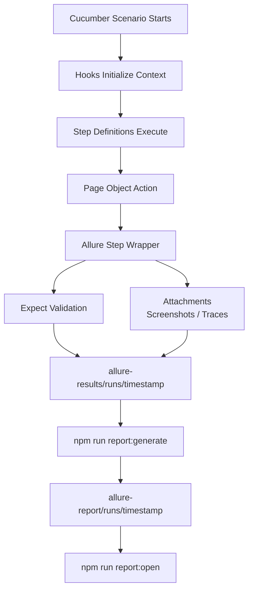
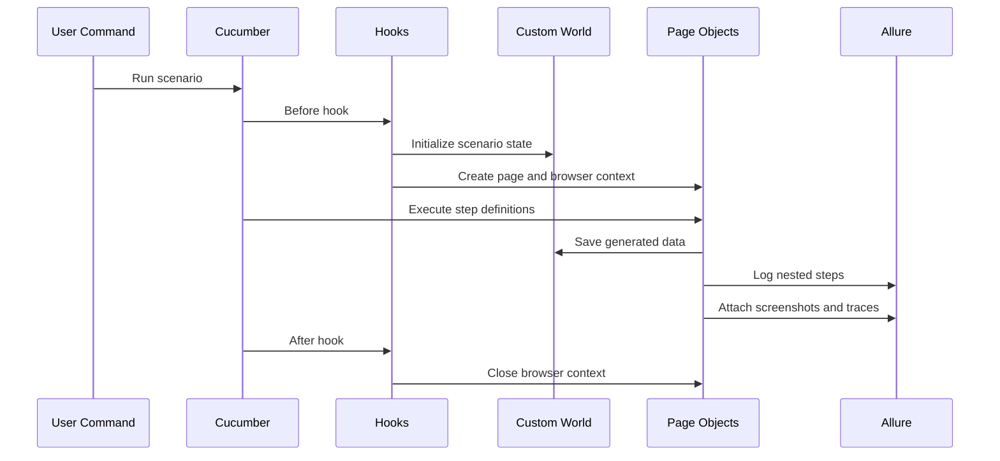

# ParaBank Playwright TypeScript Cucumber Framework

This project is a UI automation framework for ParaBank built with Playwright, TypeScript, Cucumber BDD, and Allure reporting.

It is designed to:

- write tests in Gherkin feature format
- implement reusable page objects in TypeScript
- generate rich Allure step-by-step execution reports
- support real end-to-end banking business flows

## Visual overview



## Tech stack

- Playwright for browser automation
- TypeScript for typed test code
- Cucumber for BDD scenarios
- Allure for execution reporting
- `dotenv` for environment-based configuration

## Current automated flow

The framework currently contains one complete business scenario in [features/customer-lifecycle.feature](features/customer-lifecycle.feature).

That scenario covers:

1. customer registration
2. opening a new savings account
3. logging in with the created credentials
4. validating account overview
5. ensuring at least two accounts exist
6. transferring funds between accounts
7. bill payment
8. account transaction review with screenshots attached to Allure
9. updating contact information
10. loan request and approval validation

### Business flowchart



## Project structure

```text
features/
  customer-lifecycle.feature
  step-definitions/
    customer-lifecycle.steps.ts
  support/
    hooks.ts
    world.ts

src/
  config/
    env.ts
  core/
    browserManager.ts
  models/
    bank.ts
  pages/
    AccountActivityPage.ts
    AccountsOverviewPage.ts
    AccountServicesPage.ts
    BillPayPage.ts
    LoginPage.ts
    OpenNewAccountPage.ts
    RegistrationPage.ts
    RequestLoanPage.ts
    TransferFundsPage.ts
    UpdateContactInfoPage.ts
  utils/
    money.ts
    reporting.ts
    testDataFactory.ts

scripts/
  run-cucumber.mjs
  generate-allure.mjs
  open-allure.mjs
```

## Framework architecture

### Architecture flowchart



### `features/`

This is the BDD layer.

- `.feature` files contain business-readable scenarios
- `step-definitions` connect Gherkin steps to Playwright code
- `support/hooks.ts` manages browser context, tracing, screenshots, and Allure setup
- `support/world.ts` stores runtime scenario state such as generated credentials and account numbers

### `src/pages/`

This is the Page Object Model layer.

Each page class contains:

- locators
- page-specific actions
- validations using `expect`
- Allure-wrapped reporting steps

### `src/utils/`

Utility helpers are used for:

- currency parsing and formatting
- reusable Allure step wrappers
- random test-data generation for registration, payee details, and contact updates

### `src/config/env.ts`

This file loads runtime configuration from `.env`.

### `src/core/browserManager.ts`

This manages Playwright browser launch and close so the framework uses a shared browser instance across scenarios.

## Prerequisites

- Node.js 18 or newer
- Java installed for Allure CLI generation

Note:

- This framework currently uses `@cucumber/cucumber@11.3.0` because it is compatible with Node `18.14.1`
- newer Cucumber versions require newer Node versions

## Installation

Install dependencies:

```bash
npm install
```

Install Playwright browser binaries:

```bash
npm run pw:install
```

If you want all supported browsers:

```bash
npm run pw:install:all
```

## Environment configuration

Create a `.env` file from `.env.example`.

Example:

```env
BASE_URL=https://parabank.parasoft.com/parabank/
PARABANK_USERNAME=john
PARABANK_PASSWORD=demo
BROWSER=chromium
HEADLESS=true
TIMEOUT=30000
SLOW_MO=0
```

### Environment variables

- `BASE_URL`
  Base ParaBank URL used by Playwright context.

- `PARABANK_USERNAME`
  Default login username for generic login scenarios.
  Note: the customer lifecycle flow creates its own random user during execution.

- `PARABANK_PASSWORD`
  Default login password for generic login scenarios.

- `BROWSER`
  Supported values: `chromium`, `firefox`, `webkit`

- `HEADLESS`
  `true` or `false`

- `TIMEOUT`
  Base framework timeout in milliseconds

- `SLOW_MO`
  Playwright slow motion value in milliseconds

## How to run

### Main command

To run the full suite manually:

```bash
npm test
```

### Direct Cucumber command

If you want to run the current end-to-end business scenario directly:

```bash
npx cucumber-js --name "Register, transact, update profile, and request a loan"
```

### Run smoke tests

```bash
npm run test:smoke
```

### Run in headed mode

```bash
npm run test:headed
```

### Run in Firefox

```bash
npm run test:firefox
```

### Run in debug style

```bash
npm run test:debug
```

This runs headed mode with `slowmo` enabled.

### Run flowchart



## Publish to GitHub

If this project is not yet connected to a GitHub repository, use the commands below from the project root.

```bash
git init
git add .
git commit -m "Initial commit for ParaBank Playwright framework"
git branch -M main
git remote add origin https://github.com/<your-username>/<your-repo-name>.git
git push -u origin main
```

If the repository already exists on GitHub, create the remote first and then push your current branch.

### GitHub publish flow



## Useful commands

Type check the framework:

```bash
npm run typecheck
```

Generate Allure report:

```bash
npm run report:generate
```

Open latest Allure report:

```bash
npm run report:open
```

## GitHub Actions CI/CD

The repository now includes a GitHub Actions workflow at [.github/workflows/ci.yml](.github/workflows/ci.yml).

It runs automatically on:

- push to `main`
- push to `master`
- pull requests targeting `main`
- pull requests targeting `master`
- manual execution through `workflow_dispatch`

### What the pipeline does

1. checks out the repository
2. sets up Node.js 18
3. sets up Java 17 for Allure CLI
4. installs project dependencies with `npm ci`
5. installs Playwright Chromium with OS dependencies
6. runs `npm run typecheck`
7. runs `npm test`
8. generates the Allure HTML report
9. uploads raw and HTML test artifacts

### CI/CD flowchart



### Downloading test artifacts from GitHub Actions

After a workflow run completes, GitHub stores the following artifacts:

- `allure-results`
- `allure-report`
- `execution-artifacts`

These artifacts let you inspect:

- raw Allure result files
- generated HTML Allure report
- Playwright traces and framework runtime outputs

### CI environment defaults

The workflow uses these defaults in GitHub Actions:

```yaml
HEADLESS: true
BROWSER: chromium
BASE_URL: https://parabank.parasoft.com/parabank/
PARABANK_USERNAME: john
PARABANK_PASSWORD: demo
TIMEOUT: 30000
SLOW_MO: 0
```

If you later want to run against a different environment, you can replace these values in the workflow or move them to GitHub repository secrets and variables.

## Allure reporting behavior

This framework is built so that every meaningful business step is shown in Allure.

Examples:

- opening login page
- navigating to registration
- filling customer form
- opening savings account
- transferring funds
- bill payment
- visiting each account's activity page
- updating profile
- applying for a loan

### Reporting flowchart



### Attachments included in Allure

- failure screenshot when a scenario fails
- Playwright trace when a scenario fails
- transaction screenshots for each reviewed account during the business flow

### Allure output folders

Raw results are generated under:

```text
allure-results/runs/<timestamp>
```

Generated HTML reports are stored under:

```text
allure-report/runs/<timestamp>
```

This timestamped structure helps avoid Windows file-lock issues when older reports are still open.

## Validation strategy

The framework uses Playwright `expect` for:

- page load validation
- URL validation
- element visibility checks
- confirmation text validation
- account existence checks
- transfer success verification
- bill payment success verification
- loan approval validation

## Test data strategy

The framework generates random test data for:

- customer registration
- payee details
- contact updates
- loan inputs

This helps reduce collisions between repeated executions.

## Important ParaBank behavior

One application limitation to keep in mind:

- the `Open New Account` page does not expose a free-text amount field for the opening deposit
- ParaBank uses its own built-in funding flow from an existing account

Because of that, the framework opens the new account using the available funding source selected in the UI instead of entering a custom deposit amount there.

## How a scenario works internally

At runtime:

1. Cucumber starts the scenario
2. hooks create a fresh browser context and page
3. random customer data is generated
4. the scenario stores generated values in the custom world
5. page objects execute actions and assertions
6. Allure records nested execution steps
7. screenshots or traces are attached when needed
8. the browser context is closed after the scenario

### Runtime lifecycle flowchart



## Extending the framework

To add more coverage:

1. add a new `.feature` file under `features/`
2. create step definitions under `features/step-definitions/`
3. add or reuse page objects under `src/pages/`
4. keep validations in page objects wherever possible
5. wrap meaningful business actions using the reporting helper so Allure remains readable

## Recommended conventions

- keep feature files business-readable
- keep locator logic inside page objects
- keep scenario state inside the custom world
- keep random data generation in utility helpers
- use `expect` only where it validates real behavior
- avoid putting raw locators directly into step definitions unless absolutely necessary

## Verification status

The current framework has already been validated with:

- `npm run typecheck`
- `npx cucumber-js --name "Register, transact, update profile, and request a loan"`
- `npm test`
- `npm run report:generate`
